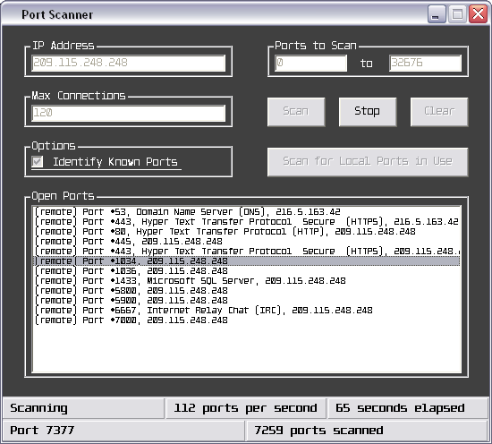



## Remote and Local Port Scanner

### Description

I know there are other port scanners posted here at PSC, and definitely they're a ton better than this, but no matter, this code is well documented and is great to use for learning about winsock.

This port scanner allows the user to do two things... either do a scan to find all the ports that are in use (within the port range specified) on the local machine, or do a scan to find all the ports that are accepting connections on another machine (though you can scan yourself as well).

The user specifies a target IP address, a port range (0-32676), and the max amount of winsock elements that can be loaded at once (this doesn't mean that the program will be limited to scanning that amount of ports per second, though). As well, there's an option for the user to have the name of the port (what the port is used for) displayed (if it's documented - there's an array in the program that has the names of the ports).

The port scanner closes connections and counts them out as errored connections if a connection is not established between the machines on a particular port within .75 seconds of the time the request is sent...
 
### More Info
 

             |
---                |---
**Submitted On**   |2002-05-11 20:09:06
**By**             |[Josh Simmons](https://github.com/Planet-Source-Code/PSCIndex/blob/master/ByAuthor/josh-simmons.md)
**Level**          |Intermediate
**User Rating**    |4.8 (19 globes from 4 users)
**Compatibility**  |VB 5\.0, VB 6\.0
**Category**       |[Internet/ HTML](https://github.com/Planet-Source-Code/PSCIndex/blob/master/ByCategory/internet-html__1-34.md)
**World**          |[Visual Basic](https://github.com/Planet-Source-Code/PSCIndex/blob/master/ByWorld/visual-basic.md)
**Archive File**   |[Remote\_and820885112002\.zip](https://github.com/Planet-Source-Code/josh-simmons-remote-and-local-port-scanner__1-34708/archive/master.zip)

